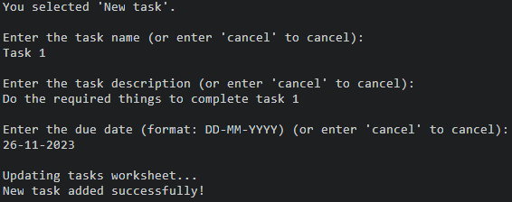
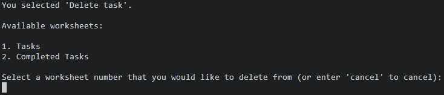

# Terminal To Do
The Terminal To Do app is a command-line task manager designed for simplicity and efficiency. Users interact via a text-based interface to view, add, complete, and delete tasks. It utilizes Google Sheets for data storage, enhancing organization and helping users stay on top of their daily activities.

!!!!!ADD LINK TO LIVE PROJECT<<<<<

!!!!!SCREENSHOT OF DEPLOYED APP IN RESPONSIVE DESIGN<<<<<

# How To Use

Terminal To Do is smoothly integrated with Google Sheets to streamline task tracking. Refer to the 'setup_guide.md' for detailed instructions on configuring your personalized task management spreadsheet.

This application empowers you to showcase an entire task list, generate new tasks complete with descriptions and due dates, designate tasks as completed and shift them to a dedicated sheet for accomplished tasks within the spreadsheet. Additionally, you have the flexibility to remove tasks from either your active task list or the catalog of completed tasks as needed—all within the confines of the terminal window.

# Features

## Existing Features

### Main Menu

- User-friendly main menu with numbered options for easy interaction.
- Minimises user input errors by utilising numbers to correspond with actions.

- Clear error messages guide users to correct input issues and proceed with their intended actions.

### Show Tasks

- Option 1, "Show Tasks", provides an overview of task names, descriptions, and due dates.
- Tasks are displayed in a structured format for readability.

- Data validation prevents attempting to display tasks when none are present, guiding users with informative messages.

### New Task

- Option 2, "New Task", guides users through adding a new task to the 'tasks' worksheet.
- Users input task name, description, and due date.

- Robust data validation checks prevent the creation of tasks with empty names or descriptions and ensure that due dates are in the correct format and are not in the past tense.

- An option to cancel is provided to the user, which cancels the task creation and redirects the user back to the main menu, preventing users from naming tasks 'cancel' in the process.

### Complete Task

- Option 3, "Complete Task", allows users to mark a task as complete, moving it to the 'completed_tasks' worksheet.
- Users are asked to input the name of the task to mark as complete.

- Users are given an option to cancel task completion and return to the main menu.
- Data validation ensures a valid task name is entered, with error messages guiding users if the task is not found.

- Updates both 'tasks' and 'completed_tasks' worksheets upon successful completion.

### Delete Task

- Option 4, "Delete Task", prompts users to select the task sheet ('tasks' or 'completed_tasks') and enter the task name for deletion.

- An option to cancel and return to the main menu is provided at each stage during task deletion.
- Validates inputs, ensuring the user selects a valid sheet and enters a valid task name.

- Updates the respective worksheet and provides feedback upon successful deletion.

### Exit

- Option 5, "Exit", enables users to safely exit the application.
- Provides a clear exit message, ensuring users are informed when the program is terminating.

## Future Features

### Task Prioritisation

- The user could be able to assign tasks with different priority levels.

### Task Categories

- The tasks could be arranged into different categories or projects.

### Reminder Notifications

- Notifications or alerts could be incorporated for tasks with upcoming deadlines.

# Data Model

The data model is structured around the Google Sheets worksheet, with 'tasks' and 'completed_tasks' serving as primary entities. Each task is represented by a row in the respective worksheet, capturing details such as task name, description, and due date. The interaction with the data model is encapsulated within the application's logic, ensuring seamless integration with Google Sheets for efficient task management.

# Testing

I have diligently tested the Terminal To Do project to identify and address potential issues. The testing process includes the following:

- Utilized a PEP8 linter to ensure code adherence to style guidelines, resulting in a clean and well-formatted codebase.
- Conducted rigorous testing with various inputs, including strings instead of numbers, past tense dates, and blank inputs. This helped identify and resolve issues related to user input.
- Tested the application extensively in both my local terminal and the Code Institute Heroku terminal, ensuring compatibility and functionality across different environments.

## Resolved Bugs

### Dates for New Tasks in Past Tense

- **Issue:** Dates for new tasks could be added in the past tense.
- **Fix:** Implemented the date method from the datetime module to check if the parsed date is in the past tense, ensuring accurate date entries for new tasks.

### Multiple Tasks with the Same Name

- **Issue:** Multiple tasks can be added with the same task name.
- **Fix:** Introduced an additional validation step to check if a task already exists with the same name before allowing the user to create a new task, preventing duplicate entries.

### Redirect Loop Issue in Delete and Complete Task Functions

- **Issue:** When an incorrect task name is provided during the delete or complete task functions, the user is asked to provide a valid task name but is then redirected back to the main menu again.
- **Fix:** Incorporated a while loop to allow the user to re-enter the task name until a valid one is provided, ensuring a smoother user experience.

### Show Tasks Functionality Issue After Deleting from Completed Tasks

- **Issue:** When a user selects to delete a task from the completed tasks worksheet, the show tasks function does not work due to the space in the user input.
- **Fix:** Implemented `.replace(" ", "_")` to replace spaces with underscores in the user input, resolving the issue and allowing the show tasks function to work seamlessly after deleting from completed tasks.

### Task Named 'Cancel' Cannot Be Deleted or Completed

- **Issue:** If a user creates a task called 'cancel,' it cannot be deleted or completed.
- **Fix:** Added an option to cancel during any stage of new task creation. Subsequently, a user can no longer name a task 'cancel' as the function is canceled if 'cancel' is given as a task name, preventing issues with deletion or completion.

## Remaining Bugs

No remaining bugs have been identified after thorough testing and bug fixing.

<!-- ## Validator Testing

- PEP8
    - No errors were returned from PEP8online.com, confirming the code's compliance with PEP8 style guidelines. -->

# Deployment

Code Institute's mock terminal for Heroku has been used to deploy this project.

### Deployment Steps:

- Clone this repository
- Create a new app on Heroku
- Set up the buildpacks on your app to Python and NodeJS in this order
- Link your Heroku app to your GitHub repository
- Click Deploy to Heroku

# Credits

- Code Institute for the API credentials guide
- Code Institute for the provided terminal for Heroku deployment