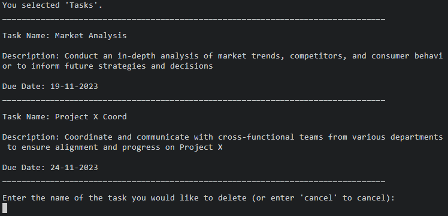
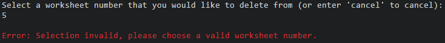
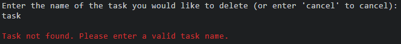

# Terminal To Do
The Terminal To Do app is a command-line task manager designed for simplicity and efficiency. Users interact via a text-based interface to view, add, complete, and delete tasks. It utilizes Google Sheets for data storage, enhancing organization and helping users stay on top of their daily activities.

!!!!!ADD LINK TO LIVE PROJECT<<<<<

!!!!!SCREENSHOT OF DEPLOYED APP IN RESPONSIVE DESIGN<<<<<

# How To Use

Terminal To Do is smoothly integrated with Google Sheets to streamline task tracking. Refer to the 'setup_guide.md' for detailed instructions on configuring your personalized task management spreadsheet.

This application empowers you to showcase an entire task list, generate new tasks complete with descriptions and due dates, designate tasks as completed and shift them to a dedicated sheet for accomplished tasks within the spreadsheet. Additionally, you have the flexibility to remove tasks from either your active task list or the catalog of completed tasks as needed—all within the confines of the terminal window.

# Features

## Existing Features

### Main Menu

- User-friendly main menu with numbered options for easy interaction.
- Minimises user input errors by utilising numbers to correspond with actions.

- Clear error messages guide users to correct input issues and proceed with their intended actions.

### Show Tasks

- Option 1, "Show Tasks", provides an overview of task names, descriptions, and due dates.
- Tasks are displayed in a structured format for readability.

- Data validation prevents attempting to display tasks when none are present, guiding users with informative messages.

### New Task

- Option 2, "New Task", guides users through adding a new task to the 'tasks' worksheet.
- Users input task name, description, and due date.

- Robust data validation checks prevent the creation of tasks with empty names or descriptions and ensure that due dates are in the correct format and are not in the past tense.

- An option to cancel is provided to the user, which cancels the task creation and redirects the user back to the main menu, preventing users from naming tasks 'cancel' in the process.

### Complete Task

- Option 3, "Complete Task", allows users to mark a task as complete, moving it to the 'completed_tasks' worksheet.
- Users are asked to input the name of the task to mark as complete.

- Users are given an option to cancel task completion and return to the main menu.
- Data validation ensures a valid task name is entered, with error messages guiding users if the task is not found.

- Updates both 'tasks' and 'completed_tasks' worksheets upon successful completion.

### Delete Task

- Option 4, "Delete Task", prompts users to select the task sheet ('tasks' or 'completed_tasks') and enter the task name for deletion.

- An option to cancel and return to the main menu is provided at each stage during task deletion.
- Validates inputs, ensuring the user selects a valid sheet and enters a valid task name.

- Updates the respective worksheet and provides feedback upon successful deletion.

### Exit

- Option 5, "Exit", enables users to safely exit the application.
- Provides a clear exit message, ensuring users are informed when the program is terminating.

## Future Features

### Task Prioritisation

- The user could be able to assign tasks with different priority levels.

### Task Categories

- The tasks could be arranged into different categories or projects.

### Reminder Notifications

- Notifications or alerts could be incorporated for tasks with upcoming deadlines.

Welcome,

This is the Code Institute student template for deploying your third portfolio project, the Python command-line project. The last update to this file was: **March 14, 2023**

## Reminders

- Your code must be placed in the `run.py` file
- Your dependencies must be placed in the `requirements.txt` file
- Do not edit any of the other files or your code may not deploy properly

## Creating the Heroku app

When you create the app, you will need to add two buildpacks from the _Settings_ tab. The ordering is as follows:

1. `heroku/python`
2. `heroku/nodejs`

You must then create a _Config Var_ called `PORT`. Set this to `8000`

If you have credentials, such as in the Love Sandwiches project, you must create another _Config Var_ called `CREDS` and paste the JSON into the value field.

Connect your GitHub repository and deploy as normal.

## Constraints

The deployment terminal is set to 80 columns by 24 rows. That means that each line of text needs to be 80 characters or less otherwise it will be wrapped onto a second line.

---

Happy coding!

BUGS:

dates for new tasks could be added in the past tense
fix - used date method from the datetime module to check if parsed_date is in past tense

multiple tasks can be added with the same task name
fix - added additional validation step to check if a task already exists with the same name before allowing the user to create a new task

when using the delete task and complete task functions the user is asked to provide a valid task name when an incorrect name is provided, but is then redirected back to the main menu again.
fix - incorporated a while loop

when a used selects to delete a task from the completed tasks worksheet, the show tasks function does not work due to the space in the user input.
fix - used .replace(" ", "_")

if a user creates a task called cancel it cannot be deleted or completed
fix - added option to cancel during any stage during the new_task creation, subsequently a user can no longer name a task 'cancel' as the function is cancelled if 'cancel' is given as a task name.

to add

consolidate code

numbered menu?
textual?

intructions to reproduce google sheet or a copy of google sheet
cred.json template cred.json.example